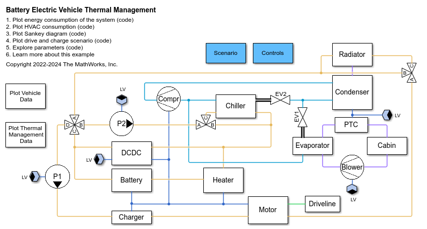
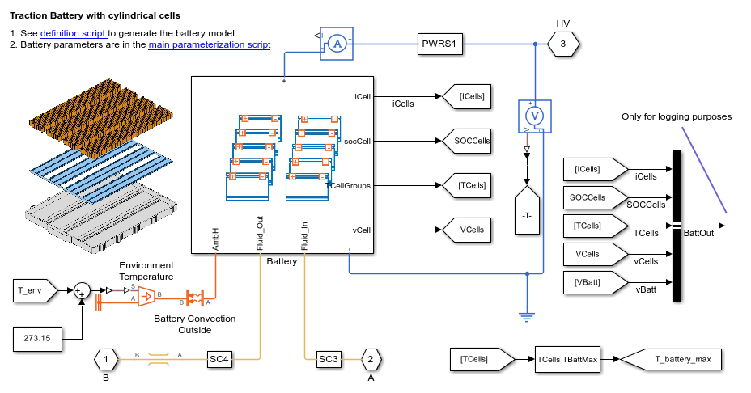
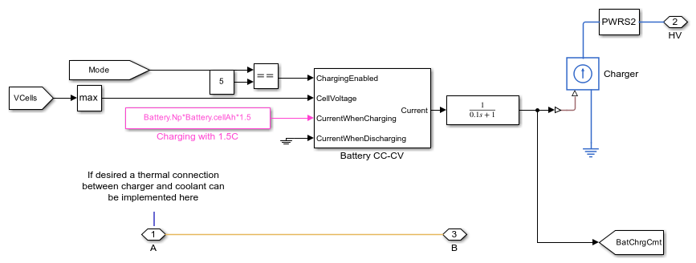
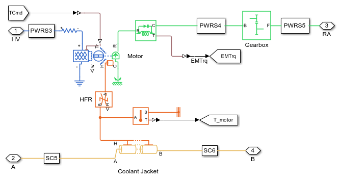
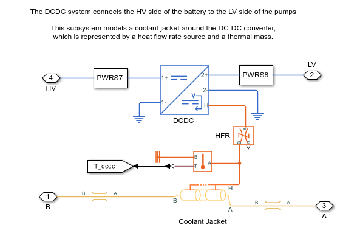
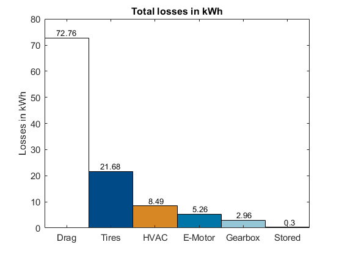
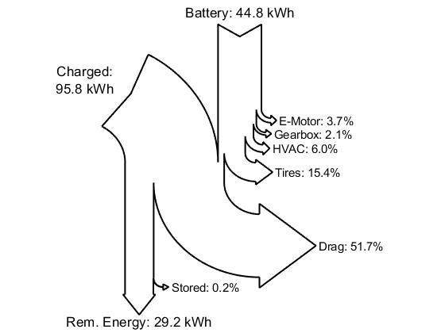

## A Holistic Approach for Designing a Battery Electric Vehicle Thermal Management System
This repository contains a model of a battery electric vehicle (BEV) with a thermal 
management system. This virtual vehicle model was parametrized to describe a mid-size electric sedan [1].

## Description
The figure below illustrates the virtual vehicle developed using Simscape and its add-on products. 
The model simulates a mid-size sedan with rear wheel drive and comprises five subsystems: 
**Electric Powertrain**, **Driveline**, **Refrigerant Cycle**, **Coolant Cycle**, and **Cabin Cycle**. 
The control algorithms are implemented in Simulink and are contained in the **Controls** subsystem.

An advantage of the virtual vehicle is its versatility: All parameters are set up by one single script. 
Therefore, the model can be easily adjusted to simulate different vehicle types, such as small city 
cars or SUVs, with minimal modifications.

### Electric Powertrain
The electric powertrain is comprised of a charger, traction battery, motor, and DC-DC converter.
The battery consists of 3072 cylindrical cells (21700 format) in a 96s32p electrical scheme, with a 
total energy of 50 kWh when fully charged. It is modeled with Simscape Battery using an electrothermal 
model. The electrical model monitors the State of Charge (SOC) of the cells, their losses, and the 
remaining capacity. The thermal model calculates the change in cell temperature due to electrical losses. 
The battery supplies current to the powertrain on the HV network and is actively cooled by a cooling 
plate composed of 12 parallel channels.

### Charger
When charging, the charger loads the battery with a constant current until the maximum cell voltage 
is reached. Subsequently, it switches to constant voltage and continues charging until the desired 
SOC is reached.

### Motor

The electric motor is driven by the HV network and is mechanically connected to the vehicle’s 
rear axle. The virtual vehicle can be easily extended to describe other powertrain architectures 
(e.g., front or all-wheel drive). The motor’s characteristics and losses are modelled with efficiency 
maps. Its temperature depends upon the electrical losses and its thermal mass. To transmit the 
torque to the wheels, the motor is coupled with a gearbox with a constant transmission ratio. 
The gearbox losses are modelled with a constant efficiency.

### DC-DC Converter

The DC-DC converter transforms the battery’s voltage (~380 V) to a lower voltage level (12 V) 
and supplies the LV components (pumps, blower, and condenser fan). Electrical losses are accounted 
for with a constant efficiency. A thermal model calculates the temperature change based on the 
DC-DC thermal mass and its electrical losses.

### Refrigerant Cycle
The refrigerant cycle comprises compressor, condenser, chiller expansion valve (EV1), evaporator 
expansion value (EV2), chiller, and evaporator. More information regarding the refrigerant cycle 
is available at [2].

The refrigerant flow is driven by the compressor, which is connected to the HV electrical network. 
The refrigerant flow continues to the condenser where heat is dissipated to the air. The air flow 
within the condenser is driven by the vehicle speed the condenser fan. Latter is connected to the 
LV network.

The refrigerant then flows through EV1 and EV2 and continues to chiller and evaporator. In the 
chiller, the refrigerant absorbs heat from the coolant cycle. In the evaporator the refrigerant 
absorbs heat from the cabin air and continues its way back to the compressor.

### Coolant Cycle
The coolant cycle comprises motor pump (P1), battery pump (P2), radiator, radiator bypass valve, 
heater, chiller bypass valve, and four-way valve. This cycle cools down the electric powertrain 
components. More information to this regard is available at [2].

The pumps P1 and P2 drive the coolant flow and are supplied by the LV network. In the radiator, 
the coolant dissipates heat to the neighboring air (driven by the fan and the moving vehicle). 
If the outer temperature is lower than 20°C, the radiator is bypassed. If the battery reaches a 
temperature below 5°C, the heater is activated (supplied by HV current) and heats up the coolant. 
If the battery reaches a temperature below 30°C the chiller is bypassed via the chiller bypass valve. 
Finally, the four-way valve can switch between a parallel and a serial cooling strategy based on the 
environmental conditions and the temperatures of the powertrain components. In serial mode 
(A connected to B, C connected to D), the battery coolant loop is connected to the motor coolant loop. 
In parallel mode (A connected to D, B connected to C), the two coolant loops are separated and 
operate with their own coolant tanks and pumps. 

## Cabin Cycle
The cabin cycle comprises cabin, blower, Positive Temperature Coefficient Heater (PTC), and 
evaporator. More information to this regard is available at [2].

The cabin subsystem models the thermal resistances between interior and external environment 
(considering the convection and conduction through doors, roof, and widows). Additionally, the 
model also accounts for the radiation heat entering the cabin.

The blower drives the airflow in the cabin and is supplied by the LV network. The air from the 
blower passes through the evaporator where it can dissipate its heat to the refrigerant. If 
cabin heating is required, the PTC is activated and heats up the air entering the cabin. Otherwise, 
the PTC remains turned off. 

## Controls
The control system is implemented in Simulink. It controls several functions of the thermal 
management among which:
- Bypass valve for radiator and chiller
- Command for heater and PTC heater
- Switching between parallel and serial cooling model (see [1] and [2] for more information to this regard)
- Power request for Pumps (P1 and P2 in the fgure), compressor, radiator, and condenser fan
- Controller for driver commands

### Postprocessing
After simulation the results are processed by the function [calcVehicleEnergy.m](/Scripts_Data/Scripts/04_PlotFunctions/calcVehicleEnergy.m). This function calculates the losses (in kWh) of each subsystem of the vehicle. The results can be represented in different ways.
First possible way is to employ the functions [plotVehicleEnergy.m](/Scripts_Data/Scripts/04_PlotFunctions/plotVehicleEnergy.m) and [plotHVACEnergy.m](/Scripts_Data/Scripts/04_PlotFunctions/plotHVACEnergy.m) to plot the consumptions as bar plots. An exemplarly plot is shown below:

It is also possible to use the [plotEnergySankey.m](/Scripts_Data/Scripts/04_PlotFunctions/plotEnergySankey.m) function to represent the overall consumption with a Sankey diagram

{width=40%}

Alternatively, if not interested specifically in the consumption, the best way to 
analyze the overall results of the model is with the 
[Simscape Results Explorer](https://www.mathworks.com/help/simscape/ug/using-the-simscape-results-explorer.html).
 
## Installation
The model was developed using MATLAB release R2023a and requires the following products:
   * [MATLAB&reg;](https://www.mathworks.com/products/matlab.html)
   * [Simulink&reg;](https://www.mathworks.com/products/simulink.html)
   * [Stateflow&reg;](https://www.mathworks.com/products/stateflow.html)
   * [Simscape&trade;](https://www.mathworks.com/products/simscape.html)
   * [Simscape Battery&trade;](https://www.mathworks.com/products/simscape-battery.html)
   * [Simscape Driveline&trade;](https://www.mathworks.com/products/simscape-driveline.html)
   * [Simscape Electrical&trade;](https://www.mathworks.com/products/simscape-electrical.html)
   * [Simscape Fluids&trade;](https://www.mathworks.com/products/simscape-fluids.html)

## Usage
The parametrization of the single components has been checked for consistency. The 
entire vehicle model has been parametrized similar to a mid-size electric sedan and is 
representative for this type of vehicle. If desired, other vehicles can be simulated by 
adapting the parameterization.

## Support
For any questions regarding the model place a comment in the repository.

## Authors and acknowledgment
* Lorenzo Nicoletti: Developer
* Steve Miller: Technical support

The authors would like to thank [Sherpa Engineering](https://www.sherpa-eng.com/en/) for their 
support and expertise in developing the model and the test scenarios.

## License
See [license](LICENSE.md) file attached to this repository

## Project status
In development

## Sources
[1] A Holistic Approach for Designing a Battery Electric Vehicle Thermal Management System, 
Steve Miller, Lorenzo Nicoletti

[2] The MathWorks. “Electric Vehicle Thermal Management - MATLAB & Simulink.”, Available 
[here](https://www.mathworks.com/help/hydro/ug/sscfluids_ev_thermal_management.html). 
 
